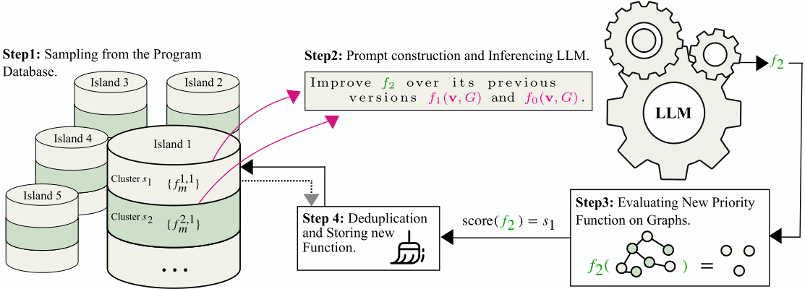

## LLM-Guided Search for Deletion-Correcting Codes

<div align="center">
  
</div>

<p>&nbsp;</p>

This repository provides a **distributed implementation of FunSearch** (Romera et al., 2024) using RabbitMQ for parallelization via asynchronous message passing. The code accompanies the paper *"LLM-Guided Search for Deletion-Correcting Codes"* and is designed for discovering large deletion-correcting codes for any code length and deletion correction capacity.

FunSearch iteratively refines a **priority function** using **evolutionary search** guided by a pretrained **LLM** (default: Starcoder2, with support for GPT-4o Mini via API). 

In each iteration:
- A few-shot prompt is constructed by sampling from the program database.
- The LLM generates a new priority function.
- The function is evaluated by greedily constructing deletion-correcting codes for various code lengths, with a fixed or variable number of deletions.
- If the function is executable and unique, it is stored in the database.

### Modifications for Other Applications
FunSearch can be adapted to different applications with minimal changes:
- **Input format & specification script:** Modify these to adjust the application-specific input format and evaluation logic.
- **LLM model:** You can modify the `checkpoint` parameter in the sampler script to use any open-source LLM that can be loaded from Hugging Face via `transformers.AutoModelForCausalLM`.
___
## **Installation & Setup**

To set up and run FunSearch, follow the instructions based on your preferred execution method.

### **1. Clone the Repository**

Clone the FunSearch repository and navigate into the project directory:

```sh
git clone https://github.com/your-username/funsearch.git
cd Funsearch
```

### **2. Choose an Execution Method**

FunSearch can be run in different environments, with or without GPU/API-based LLM inference:

- **Docker Container** – (Containerized isolated execution)
- **Local Execution** – (Without Docker)
---

### **3. Execution with Docker**

FunSearch uses **Docker Compose (v3.8)** to run two containers:

- `funsearch-main` (`pytorch/pytorch:2.2.2-cuda12.1-cudnn8-runtime`) – Runs PyTorch execution tasks with GPU support.
- `rabbitmq` (`rabbitmq:3.13.4-management`) – Handles message passing.

You can navigate to the `.devcontainer` to start the containers:

```sh
cd .devcontainer
docker-compose up --build -d
```
Both containers run inside a **Docker bridge network** (`app-network`). 

- **Internal communication** – The main container connects to RabbitMQ via `rabbitmq:5672` (instead of `localhost`). The hostname in `/src/experiments/experimentX/config.py` is set to match this configuration by default.
- **External access** – The RabbitMQ **Management Interface** is a web-based dashboard that allows you to monitor message load, processing rates, and system status across components.  

  This interface is enabled by default in Docker execution and is available at:
  ```
  http://localhost:15672
  ```
  The RabbitMQ Management Interface provides a web-based dashboard for monitoring message load, processing rates, and system status across components. 

  You can modify `docker-compose.yml` to change ports.

#### **3.1. Create and Activate a New Conda Environment (inside Docker)**

We recommend creating a clean Conda environment:

```sh
# Ensure conda is initialized for your shell (needed inside Docker)
conda init bash
source ~/.bashrc 
# Create and activate the Conda environment
conda create -n funsearch_env python=3.11 pip numpy==1.26.4 -y
conda activate funsearch_env
```

#### **3.2. Install PyTorch matching the Docker CUDA version (inside Docker) *(_Can be skipped if using LLM inference over API_)***

Install PyTorch (matching CUDA version `12.1` used by `funsearch-main` container):

```sh
pip install torch torchvision torchaudio --index-url https://download.pytorch.org/whl/cu121
```

#### **3.3. Install FunSearch package (inside Docker)**

Finally, you can install FunSearch with:

```sh
pip install .
```
---
### **4. Execution without Docker**

If you prefer to run FunSearch without Docker, follow these steps:

#### **4.1. Create a Conda Environment**

Create a clean Conda environment:

```sh
conda create -n funsearch_env python=3.11 pip numpy==1.26.4 -y
conda activate funsearch_env
```

#### **4.2. PyTorch Installation (Matching CUDA)** *(_Can be skipped if using LLM inference over API_)*

You can find the compatible PyTorch versions [here](https://pytorch.org/get-started/previous-versions/). Installation command for CUDA `12.1`:

```sh
conda install pytorch==2.2.2 pytorch-cuda=12.1 -c pytorch -c nvidia -y
```

#### **4.3. Install FunSearch package**

Finally, install FunSearch:

```sh
pip install .
```

#### **4.4. Start RabbitMQ Service (root access required)**

RabbitMQ must be started before running FunSearch. If RabbitMQ is **not installed** yet, install it using:

```sh
sudo apt update && sudo apt install rabbitmq-server -y
```

After installation, RabbitMQ **automatically starts as a system service**. To check its status:

```sh
sudo systemctl status rabbitmq-server
```

If RabbitMQ is already installed but not running, start it with:

```sh
sudo systemctl start rabbitmq-server
```

To connect FunSearch to RabbitMQ when running **without Docker**, set the RabbitMQ host in `/src/experiments/experimentX/config.py` to:

```sh 
host: "localhost"
```

### **Optional: Enable the Management Interface (Monitor Load and Processing Rates)**
The RabbitMQ **Management Interface** provides a web-based dashboard for monitoring message load, processing rates, and system status across components. Enable it with:

```sh
sudo rabbitmq-plugins enable rabbitmq_management
sudo systemctl restart rabbitmq-server
```

If running **locally**, you can now access the **Management Interface** at:

- **Web UI:** [http://localhost:15672](http://localhost:15672)
- **Login Credentials (default):** `guest / guest`


If RabbitMQ is running on a remote server, you cannot access the Management UI directly. To forward these ports (default is 15672 for management) to your local machine, use an SSH tunnel:
```sh
ssh -J <jump-user>@<jump-server> -L 15672:localhost:15672 <username>@<remote-server> -N -f
```

___
## **Usage**
You can start an evolutionary search experiment using configurations specified in an experiment file, e.g., `experiments/experimentX/config.py`. The config file contains explanations for each argument.

To launch the search, run:
```bash
python funsearch.py --config-path experiments/experimentX/config.py 
```

General settings, resource management, and termination criteria are specified via **command-line arguments**:

#### General Settings

`--save_checkpoints_path /path/to/checkpoints`
Specify where checkpoints should be saved (default: `Checkpoints/`). It is recommended to set this to `experiments/experimentX/Checkpoints`.

`--checkpoint /path/to/checkpoint`
Path to a checkpoint file from which the search should continue (default: `None`).

#### Resource Management
`--no-dynamic-scaling`
Disable dynamic scaling of evaluators and samplers based on message load (default: enabled).

`--check_interval 120`
Interval in seconds for checking resource allocation (default: `120s`).

`--max_evaluators 1000`  
`--max_samplers 1000`
Maximum number of evaluators and samplers that can be created dynamically. Defaults to large value for scaling based on resource utilization without hard limits.

#### Termination Criteria
`--prompt_limit 400000`
Once this limit is reached, no new prompts will be published. Remaining messages in the queues will still be processed to ensure exactly `prompt_limit` functions are handled.

`--optimal_solution_programs 20000`
Number of additional programs to generate after finding the first optimal solution.

`--target_solutions '{"(6,1)": 8, "(7,1)": 14, "(8,1)": 25}'`
JSON dictionary specifying target solutions for `(n, s_value)`. If set, the experiment terminates early once a target solution is found.

